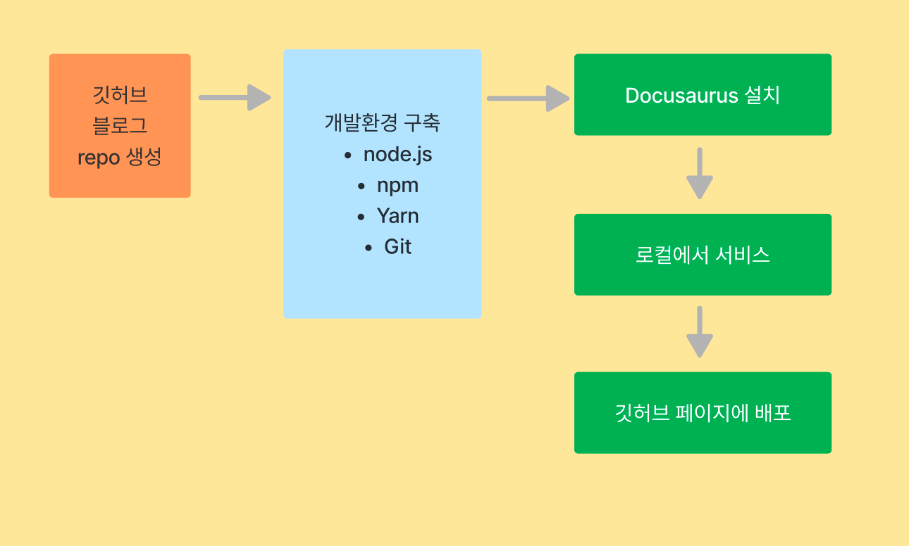
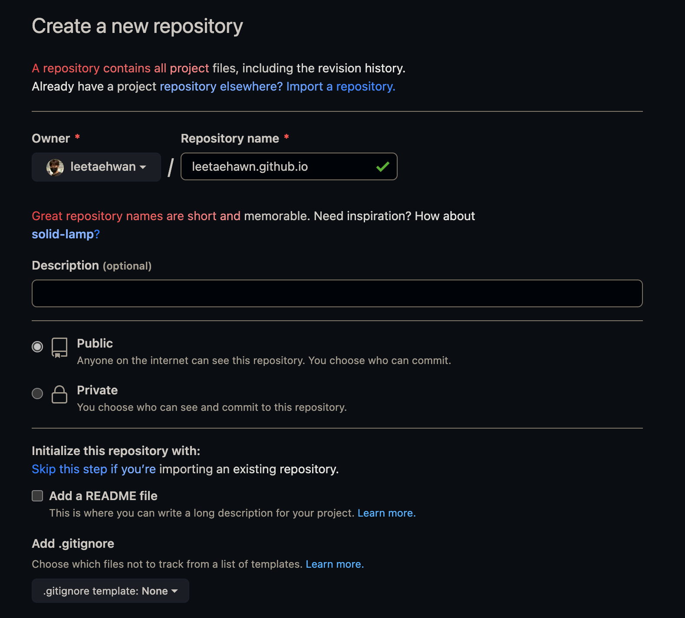
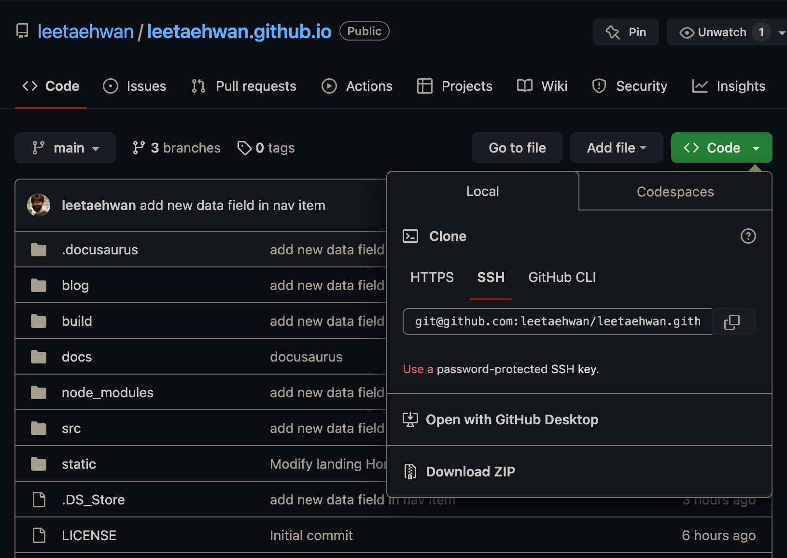
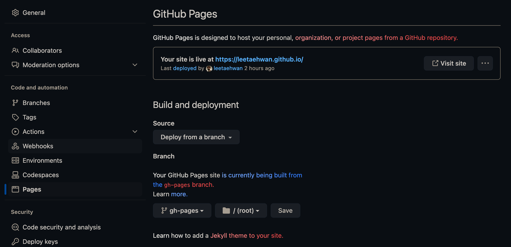

- 깃허브 페이지에 Docusaurus 블로그 사이트를 서비스해보자. 

# 목적
- GitHub 블로그를 만들어보자.
- Docusaurus를 사용해보자.

# 작업순서

1. 깃허브 블로그 repo 생성
2. 개발환경 구축
3. Docusaurus 설치
4. 로컬에서 서비스
5. 깃허브 페이지에 배포

# 깃허브 블로그 repo 생성

- Repo 이름은 github 아이디.github.io로 작성한다.
- Public 상태로 설정된 걸 확인하고 생성한다.

# 개발환경 구축
- Docusaurus 블로그를 구축하기 위해서는 Node.js, npm, yarn, git 등이 필요하다. 하나씩 따라해보자.

## Node.js
- 터미널(CLI)을 켜고, Node.js의 버전을 확인하자.
- macOS의 터미널에서는 node -v 명령어를 통해 확인할 수 있다.
- Docusaurus v2.3.1(2023.3월 기준)에는 v16.14 이상의 Node.js가 설치되어야 한다.
- nvm을 통해서 설치나 버전을 관리할 수 있다.
- 아래와 같은 명령어를 통해 최신버전으로 관리할 수 있다.

```
npm install -g npm
```

## NPM
- 위의 명령어로 npm이 설치되면 node.js와 npm이 설치가 된다.
- npm -v 명령어를 통해 버전도 확인할 수 있다.
- npm은 docusaurus를 로컬에서 테스트할 때 사용한다.

## Yarn
- Yarn을 통해서 우리는 빌드하고 배포한다.
```
npm install --global yarn
```
- 다음과 같이 yarn을 설치한다.
- 설치가 잘 됐는지, 버전을 확인하기 위해서 아래 명령어를 입력해보자.
```
yarn --version
```

# Git
- 앞서 생성한 repo를 로컬에 클론을 떠와서 작업한다.

- 위의 화면같이 코드의 SSH코드를 복사하자.
- CLI를 통하여 클론 폴더를 가질 로컬 폴더에 가서 아래의 명령어를 통해 클론을 진행한다.
```
git clone {SSH 코드}
```
- 중괄호 없이 SSH 코드를 입력한다.
- 그러면 로컬에 000.github.io repo 클론이 저장되었고, repo에 연결된다.

- 이제 다음 단계로 넘어가자

# Docusaurus 설치하기
```
npx create-docusaurus@latest my-website classic
```
- 터미널현재 경로에서 my-website 폴더가 설치된다.
- 해당 폴더 안의 폴더와 파일들을 모두 복사해 클론 repo인 000.github.io 폴더 안에 붙여넣는다.
- 아래와 같이 깃 허브에 add / commit / push를 해보자.
```
git add .
```
```
git commit -m 'test'
```
```
git push
```

## 로컬에서 docusaurus 서비스 테스트
- 다시 CLI에서 000.github.io 폴더에 접근하여 아래 명령어를 입력한다.
```
yarn run start
```
- 그러면 http://localhost:3000 로컬 url을 통해서 접속할 수 있다.

## 깃허브 페이지에 호스팅하기
- docusaurus를 호스팅하는 다양한 방법이 있지만, 여기서는 깃허브페이지에 호스팅한다.
- 먼저 빌드를 해야된다.
```
yarn build
```
- 이렇게 하면 build 폴더안에 콘텐츠들이 만들어진다. 이제 호스팅에 배포해보자.
```
GIT_USER={깃허브 유저명} USE_SSH=true yarn deploy
```
- 이렇게 하면 gh-pages라는 브랜치가 생성된다.
- 여기 까지 했다면 깃허브 repo의 page 설정을 다시 확인해보자.

- 그림과 같이 페이지 설정에 들어가서, gh-pages라는 브랜치로 저장한다.

- 이제 000.github.io에 접속해보자.
- 이제 내용을 꾸며보자.