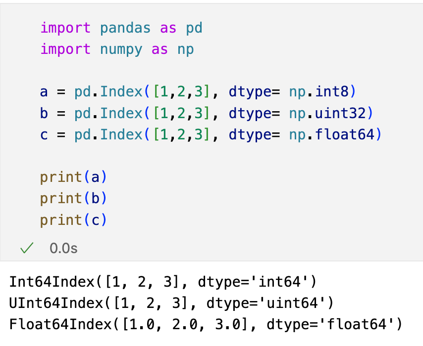
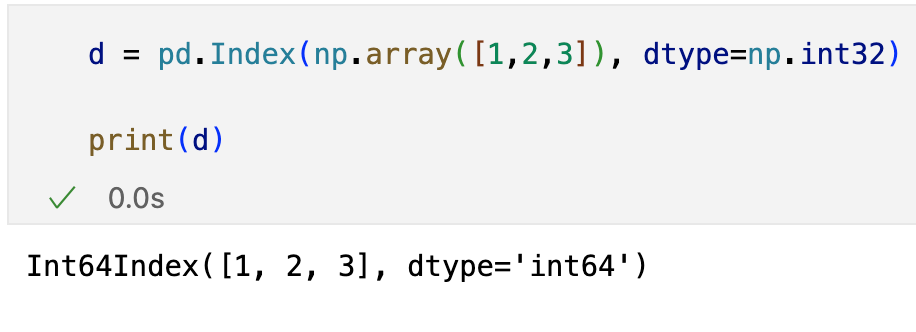
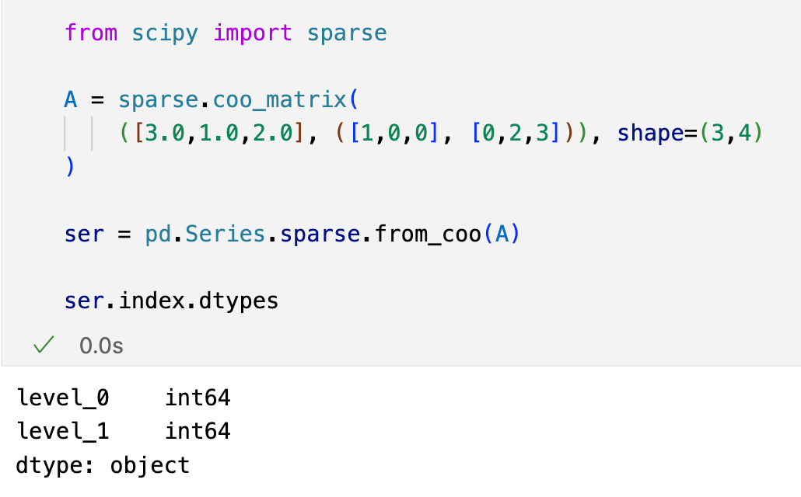
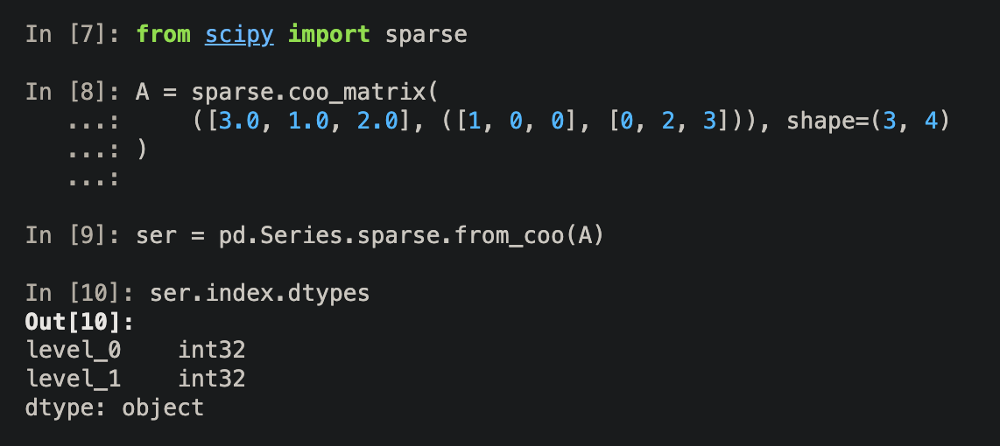

## 다양한 자료형을 지원하는 인덱스
- 인덱스가 dtype 속성에서 더많은 넘파이 숫자 자료형으로 지정할 수 있다. (e.g. np.int8, np.unit32, float32)
	- 기존에는 np.int64, np.uint64와 np.float64만이 지정가능했다.

- 기존에는 인덱스의 자료형이 int, uint, flaot으로만 지정되고,
- 64비트로만 지정이 가능으며 Int64Index 등으로 표현되었다.
- 판다스2.0 부터는 다양한 비트의 숫자 자료형을 인덱스를 지원하게 되었다.
- 그리고 인덱스의 이름도 Index로 통일되었다.

![[pandas2.0-numeric-dtype 1.png]]
- 인덱스가 더 넘파이 숫자 자료형을 가질 수 있어, 판다스 기능에 변화가 생겼다.
- 특히 64비트로 생성하도록 강제되었던 작업들이 이제는 작은 비트 사이즈를 갖는 인덱스를 생성하게 되었다.
## 넘파이 숫자 자료형으로 달라진 작업
### 넘파이 배열
- 넘파이 숫자형 배열을 인스턴스화 시킬 때 넘파이 배열의 자료형을 따르게 된다.
- 이전에는, 모든 인덱스들이 64비트로 강제된 넘파이 숫자 배열로 생성되었다.

### 숫자 날짜 속성의 DatetimeIndex 
- 판다스 2.0 이전에는 DatetimeIndex(day, month, year)의 자료형이 int64이다.
- 반면에 arrays.DatetimeArray에서는 32비트이다. 
- 2.0 이후 버전에서는 DatetimeIndex가 int32 자료형으로 변경되면서 통일되었다.

### Series.sparse.from_coo()가 int32를 지원한다.
- Series.sparse.from_coo()의 인덱스의 레벨 자료형이 int32 자료형이 되었다.
- 2.0버전 이전에는 행과 열 모두 int64 자료형을 가졌다.

- 2.0 버전부터는 행과 열의 자료형이 int32로 바꼈다.

### Index가 float16 dtype으로 인스턴스화 시킬 수 없다.
- 이전 버전에서는 Index를 float16의 자료형으로 인스턴스화 시키면 Float64Index로 생성되었다.
- 이제 float16으로 자료형을 설정한 Index 인스턴스는 NotImplementedError의 에러를 발생한다.

- 다음 변경점들은 하나씩 포스팅 해보겠다. 그럼 이만

## refference
[판다스 공식 페이지](https://pandas.pydata.org/docs/dev/whatsnew/v2.0.0.html)