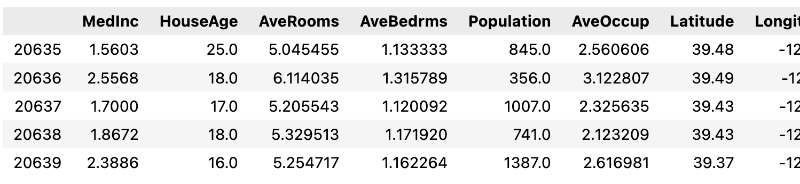

# 목적
- 파이토치를 이용해서 데이터셋을 분리하는 절차에 대해 알아보자.
- 분리하는 과정에서 사용되는 함수들에 대해 정리하자.


# 왜 파이토치인가?
- 파이토치에서 사용하는 토치는 신경망을 구성하고 훈련하는 핵심 기능을 제공하는 패키지다.
- 다차원 배열이라 불리는 텐서를 사용한다. 넘파이배열도 다차원을 지원한다.
- 하지만, 텐서는 GPU가속 지원과 텐서의 그라디언트를 자동으로 구해주는 'autograd'를 지원한다.
- 이로써, 개발자가 복잡한 연산 그래프를 정의하도록 해주고 훈련 중에 역전파에 대한 그레디언트를 자동으로 연산해준다.

# 데이터셋의 분리
- 데이터셋은 모델의 학습, 검증, 평가에 따라 구분하여 사용한다.
- 학습데이터셋은 모델에 파라미터를 학습하는데 사용하고
- 검증데이터셋은 학습하는데 사용하지 않지만, 검증데이터를 좋게 만들기 위해 하이퍼파라미터를 튜닝하거나 학습데이터를 전처리한다.
- 평가데이터셋은 다양한 모델의 성능을 비교하기 위해 사용하는 용도로 구분한다.

# 데이터프레임의 분리
## sklearn 데이터셋 불러오기
```python
from sklearn.datasets import fetch_california_housing

califonia = fetch_california_housing()
```
- sklearn.datasets에서 fetch_califonia_housing을 임포트해서 califonia에 넣어준다.
```python
df = pd.DataFrame(califonia.data, columns = califonia.feature_names)
```
- 임포트한 califonia.values를 pandas.DataFrame()인 df에 넣어준다.
- sklearn에서 임포트한 califonia는 data, target, feature_names, DESCR, frame 등의 데이터셋인 Bunch를 가지고 있다. 호출 하는 방법은 객체.(요청하는 bunch)를 통해 호출한다.
- .data는 ndarray타입으로, shpae = (20640, 8)이다.
- .feature_names은 길이가 8인 리스트이다.
```python
df["Target"] = califonia.target
```
- .target은 numpy array 타입으로, shape = (20640,)
- 만들어진 df에 "Target" 컬럼을 추가하고, califonia.target의 어레이를 넣어준다.
```python
df.tail()
```
- 데이터프레임의 하위 5개의 데이터를 드려다보면 아래와 같다.


## 파이토치의 텐서 분리하기
### float 자료형의 텐서 호출
```python
import torch

data = torch.from_numpy(df.values).float()
```
- 파이토치를 임포트하고
- df.values로 데이터프레임의 값을 넘파이배열로 호출한다.
- 호출된 배열을 from_numpy()를 통해 텐서를 반환하고
- .float()을 통해서 자료형을 선언한다.

### 입력과 출력을 나눈다.
- 텐서의 데이터셋을 입력값과 출력값(레이블)으로 분리한다.
```python
x = data[:,:-1]
y = data[:, -1:]
```
- 나누고 사이즈를 출력해보자.
- x.size() = torch.Size[20640,8]
- y.size() = torch.Size[20640,1]

### 훈련 / 검증 / 평가 데이터셋 비율 정하기
- 6:2:2로 하는게 무난하지만, 데이터셋이 클수록, 비율은 크게 상관 없다.
```python
ratios = [.6, .2, .2]
```

### 비율에 따른 데이터셋의 크기를 정하기
- 비율에 따른 데이터셋의 크기를 train_cnt, valid_cnt, test_cnt로 각각 정의하고 cnts 배열에 넣어준다.
```python
train_cnt = int(data.size(0) * ratios[0])
vaild_cnt = int(data.size(0) * ratios[1])
test_cnt = data.size(0)-train_cnt-valid_cnt

cnts = [train_cnt, valid_cnt, test_cnt]
```

### 무작위로 추출하기 위해 섞어서 분리한다.

```python
indices = torch.randperm(data.size(0))
```
- torch.randperm(n)은 0부터 n-1까지 정수의 랜덤 수열을 반환한다.
- data.size(0)는 텐서의 0차원의 크기인 20640을 반환한다.
- 즉, indices 변수는 0부터 20639까지의 정수를 랜덤 수열로 반환한다.
```python
x = torch.index_select(x, dim=0, index = indices)
y = torch.index_select(y, dim=0, index = indices)
```
- torch.index_select()를 통해서, 텐서 x,y의 0차원의 방향으로 indices를 인덱스로 하는 새로운 텐서를 반환한다.
```python
x = list(x.split(cnts, dim=0))
y = y.split(cnts, dim=0)
```
- 0차원을 따라 cnts 배열의 split_size를 가지고 분리한다.
- x를 분리하면 tuple의 자료형이라 list()로 감싸준다.

```python
for x_i, y_i in zip(x,y):
	print(x_i.size(), y_i.size())
```
- 다음과 같이 작성하고 실행하면 분리된 결과를 확인할 수 있다.
- torch.Size([12384, 8]). torch.Size([12384, 1])
- torch.Size([4128, 8]). torch.Size([4128, 1])
- torch.Size([4128, 8]). torch.Size([4128, 1])