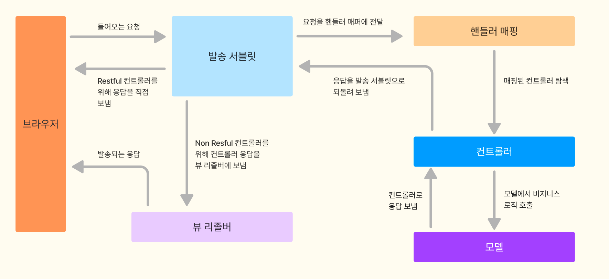

# 목적
- 애플리케이션이 어떻게 동작하는지
- 어떠한 이유로 이러한 구성을 갖게 되는지
- 위에 관한 점들을 알고 실습하기 위한 기초지식

# 서버 간 통신
- 서버 간 통신은 한 서버에서 다른 서버로 요청하는 것을 의미하는 단어로
- 통신을 요청하는 클라이언트와 응답을 내려주는 서버 간의 통신을 이야기한다.
- 가장 흔한 프로토콜이 HTTP/HTTPS 방식이다.

## 마이크로서비스 아키텍처에서 더 많이 활용된다.
- 단일 애플리케이션으로 다양한 서비스를 하면 유지보수에 따른 비용이 크다.
- 따라서, 요즘에는 여러 애플리케이션을 서비스별로 나눠서 개발한다.
- 하지만 이때문에 각자의 독립적인 애플리케이션 서버간의 통신이 잦아진다.

# 스프링 부트 동작 방식
- 스프링 부트에서는 기본적으로 톰캣을 사용하는 스프링 MVC 구조를 기반으로 동작한다.

## 서블릿
- 서블릿은 클라이언트의 요청을 처리하고 결과를 반환하는 웹프로그래밍 기술이다.
- 서블릿 컨테이너가 서블릿 인스턴스를 생성하고 관리한다.

## 스프링에서 서블릿
- 스프링에서는 발송 서블렛이 웹 애플리케이션으로 들어오는 모든 요청을 중앙제어하는 프론트 컨트롤러를 구현한다.
- 발송 서블릿이 들어오는 요청을 받아서 적절한 핸들러에 전달한다.
- 발송 서블릿이 많은 핸들러 매핑을 사용하여, 각각의 요청을 어떤 핸들러가 처리해야하는지 결정한다.
- 스픵은임베딩된 톰캣을 내장서버로서 사용하기 때문에, 서블렛, 필터와 애플리케이션을 구성하는 웹 컴포넌트들의 환경설정을 web.xml에 적는다.
- 즉, web.xml 파일안에 정의된 URL 매핑을 기반으로 적절한 서블릿과 필터로 요청을 보낸다.

## 스프링 부트의 동작 순서
1. 발송 서블렛으로 HttpServletRequest의 요청이 들어오면, 요청받은 URL에 매핑된 핸들러 컨트롤러를 탐색한다.
2. 핸들러 어댑터로 컨트롤러가 호출된다.
3. 핸들러 어댑터에 컨트롤러의 응답이 돌아오면 ModelAndVew로 응답을 가공해 반환한다.
4. 뷰 형식으로 리턴하는 컨트롤러를 사용할 때는 뷰 리졸버가 뷰를 반환한다.

## 핸들러 매핑
- 핸들러 매핑 인터페이스는 요청 정보를 기준으로 어떤 컨트롤러를 사용할 것인가 결정한다.

## 핸들러 매핑의 구현체 클래스

### BeanNameUrlHandlerMapping
- 기본설정값의 핸들러 매핑 구현체로
- 빈의 이름을 요청 URL과 매핑하는데 사용한다.
- 빈을 정의하면서, 슬래시(/)와 함께 작성된 식별자인 슬러그를 지정하여 매핑한다.
```
@Bean("/hello")
```
- '/hello'라는 슬러그에 빈이 매핑되었다.

- 이러한 매핑은 직접적인 이름 매칭과 "*"패턴을 사용하는 패턴 매칭을 돕는다.
- 수신된 URL "/foo"가 '/foo'라고 불리는 빈에 매핑된다.
- 패턴 매핑은 "/foo" 요청을 '/foo', '/foo2', '/fooOne' 등으로 매칭한다.

- 아래는 '/beanNameUrl' 요청을 다루는 빈 컨트롤러를 등록하는 소스코드이다.
```
@Configuration
public class BeanNameUrlHandlerMappingConfig {
    @Bean
    BeanNameUrlHandlerMapping beanNameUrlHandlerMapping() {
        return new BeanNameUrlHandlerMapping();
    }

    @Bean("/beanNameUrl")
    public WelcomeController welcome() {
        return new WelcomeController();
    }
}
```
- 이것이 위의 자바 기반 환경 구성과 같은 xml 코드이다.
```
<bean class="org.springframework.web.servlet.handler.BeanNameUrlHandlerMapping" />
<bean name="/beanNameUrl" class="com.baeldung.WelcomeController" />

```
- 이러한 환경설정 둘 다, BeanNameUrlHandlerMapping에 관한 빈을 정의하는 것이 필수가 아니다.
- 스프링 MVC에서 다 제공된다.
- 빈 정의를 지우는 것이 문제를 발생시키지 않기에, 요청들이 등록된 핸들러 빈에 여전히 매핑될 것이다.
- '/beanNameUrl'의 모든 요청이 발송 서블릿에 의해서 'WelcomeController'로 보내진다.
- 그러면 'WelcomeController'는 'welcome'이라는 뷰를 반환한다.
- 아래의 코드를 통해 환경설정을 테스트하고 올바른 뷰 이름을 반환하는지 확인하자.
```
public class BeanNameMappingConfigTest {
    // ...

    @Test
    public void whenBeanNameMapping_thenMappedOK() {
        mockMvc.perform(get("/beanNameUrl"))
          .andExpect(status().isOk())
          .andExpect(view().name("welcome"));
    }
}
```

### SimpleUrlHandlerMapping
- SimpleUrlHandlerMapping은 좀 더 유연한 핸들러 매핑 구현체이다.
- 이 매핑은 빈 객체와 URL 간 또는 빈 이름과 URL 간의 직접적이고 선언적인 매핑이다.
- "/simpleUrlWelcome"과 "/*/simpleUrlWelcome" 요청을 'welcome' 빈으로 매핑해보자.
```
@Configuration
public class SimpleUrlHandlerMappingConfig {

    @Bean
    public SimpleUrlHandlerMapping simpleUrlHandlerMapping() {
        SimpleUrlHandlerMapping simpleUrlHandlerMapping
          = new SimpleUrlHandlerMapping();
        
        Map<String, Object> urlMap = new HashMap<>();
        urlMap.put("/simpleUrlWelcome", welcome());
        simpleUrlHandlerMapping.setUrlMap(urlMap);
        
        return simpleUrlHandlerMapping;
    }

    @Bean
    public WelcomeController welcome() {
        return new WelcomeController();
    }
}
```
- XML 환경설정에서도 아래와 같이 똑같이 설정할 수 있다.
```
<bean class="org.springframework.web.servlet.handler.SimpleUrlHandlerMapping">
    <property name="mappings">
        <value>
            /simpleUrlWelcome=welcome
            /*/simpleUrlWelcome=welcome
        </value>
    </property>
</bean>
<bean id="welcome" class="com.baeldung.WelcomeController" />
```
- XML 환경설정을 다음과 같은 것들이 중요하다. java.util.Properties 클래스에 의해 받아지는 폼에서 < value > 태그 사이의 매핑이 이루어진다.
- 매핑을 할 때는 path = Handler_Bean_Name 의 규칙을 따른다.
- URL이 보통 리딩 슬래시와 함께 작성되지만, 경로가 하나로 시작하는 게 아니라면 스프링 MVC는 자동으로 추가해준다.

- XML에 위의 예를 설정하는 다른 방법은 'props' 속성을 'value' 속성을 대신해 사용하는 것이다.
- Props은 prop태그의 리스트를 가진다.
- prop태그를 통해서 매핑하는데, 'key'가 매핑된 URL을 참조하고 태그의 값이 빈의 이름이다.
```
<bean class="org.springframework.web.servlet.handler.SimpleUrlHandlerMapping">
    <property name="mappings">
        <props>
            <prop key="/simpleUrlWelcome">welcome</prop>
            <prop key="/*/simpleUrlWelcome">welcome</prop>
        </props>
    </property>
</bean>
```
- 아래 테스트 코드가 "/simpleUrlWelcome" 요청이 'welcome' 뷰를 반환하는 'WelcomeController'에 의해 핸들되는지 확인한다.
```
public class SimpleUrlMappingConfigTest {
    // ...

    @Test
    public void whenSimpleUrlMapping_thenMappedOK() {
        mockMvc.perform(get("/simpleUrlWelcome"))
          .andExpect(status().isOk())
          .andExpect(view().name("welcome"));
    }
}
```

### ControllerClassNameHandlerMapping
- URL과 일치하는 클래스 이름을 갖는 빈을 컨트롤러로 사용한다.
- ControllerClassNameHandlerMapping은 URL을 등록된 컨드롤러 빈(@Controller 주석이 언급된 컨트롤러)에 매핑한다.
- 컨트롤러의 이름은 같은 이름을 가지거나 그 이름으로 시작한다.

- 많은 경우에서 더 편리할 수 있는데, 특히 하나의 요청 형을 핸들링하는 단순한 컨트롤러 구현체에 경우 더욱 편리하다.
- 스프링 MVC에서 사용하는 규칙은 이름에서 Controller를 제외하고 접미사를 소문자로 "/"을 붙여서 매핑한다.
- "WelcomeController"는 "/welcome*"을 매핑한다. 즉, "welcome"으로 시작하는 어떠한 URL이 매핑된다.
```
@Configuration
public class ControllerClassNameHandlerMappingConfig {

    @Bean
    public ControllerClassNameHandlerMapping controllerClassNameHandlerMapping() {
        return new ControllerClassNameHandlerMapping();
    }

    @Bean
    public WelcomeController welcome() {
        return new WelcomeController();
    }
}
```
- ControllerClassNameHandlerMapping이 스프링 4.3에서 사라지게되었다. 주석 주도 핸들러 방법이 선호되어지기 때문이다.
- 컨트롤러 이름이 항상 컨트롤러 접미사를 지우고 소문자로 반환한다는 것도 중요하다.
- 따라서 '/welcomTaehwan'은 요청에서 처리하지 못하고 '/welcometaehwan'의 요청만 처리할 수 있다.
- 자바와 아래의 XML 환경설정 모두에서, ControllerClassNameHandlerMapping 빈을 정의하고 요청을 처리할 때 사용할 컨트롤러에 빈을 등록한다. 
- '/welcome'으로 시작하는 요청을 핸들링하는 "WelcomeControlle"를 XML로 만들어보자.
```
@Configuration
public class ControllerClassNameHandlerMappingConfig {

    @Bean
    public ControllerClassNameHandlerMapping controllerClassNameHandlerMapping() {
        return new ControllerClassNameHandlerMapping();
    }

    @Bean
    public WelcomeController welcome() {
        return new WelcomeController();
    }
}
```
- 위의 XML 환경설정을 사용하면, '/welcome'에 대한 요청이 "WelcomeController"에 의해서 핸들링된다.
- 아래 코드는 "welcometest"과 같은 "/welcome*" 요청이 'WelcomeController'에 의해서 핸들링이 되는지 테스트하고 welcome' 이름의 뷰를 반환하는지 확인한다.
```
public class ControllerClassNameHandlerMappingTest {
    // ...

    @Test
    public void whenControllerClassNameMapping_thenMappedOK() {
        mockMvc.perform(get("/welcometest"))
          .andExpect(status().isOk())
          .andExpect(view().name("welcome"));
    }
}
```

### DefaultAnnotationHandlerMapping
- 어노테이션으로 URL과 컨트롤러를 매핑한다.
- 들어오는 HTTP 요청을 주석이 있는 컨트롤러 중에 적절한 것으로 보내준다.
- 요청이 들어오면, DefaultAnnotationHandlerMapping이 스프링 ApplicationContext에 등록된 모든 빈을 스캔해서 '@RequestMapping', '@GetMapping', '@PostMapping'이나 비슷한 어노테이션을 갖는 빈을 모두 찾는다.
- 그리고 이 정보를 활용해서 어떤 컨트롤러가 요청을 핸들링할 지 결정한다.
- 또한 DefaultAnnotationHandlerMapping은 매핑 처리의 동작을 커스터마이징하는 많은 어노테이션도 지원한다. (e.g. '@PathVariable', '@RequestParam', '@RequestBody')
- 기본설정으로, DefaultAnnotationHandlerMapping이 스프링 MVC 구성에 포함되어 들어오는 HTTP 요을 핸들링하는데 사용된다.
- 하지만 필요하다면, 다른 매핑 전략으로 대체되거나 커스터마이징 될 수 있다.


# Refference
- [Baeldung](https://www.baeldung.com/spring-handler-mappings)